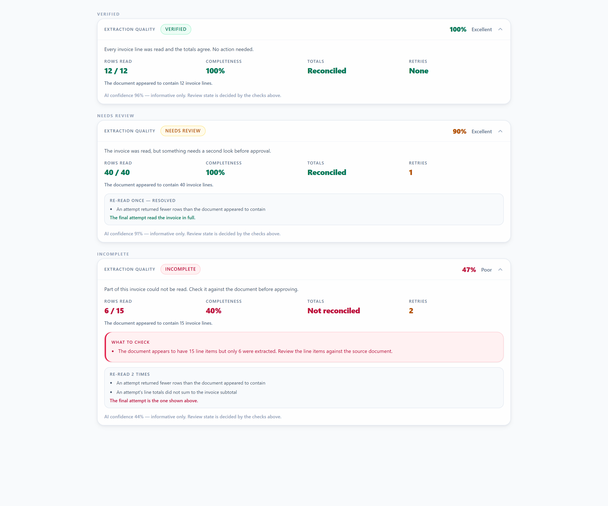

# Supplier Invoice Extraction Engine — Certification Report

> ## Status: **Architecture Certified — Awaiting Production Dataset Certification**
>
> The Kingdom Foods certification dataset is **not present in this repository**. The live run has
> therefore never been executed, and this subsystem is **not** yet
> *VYRON COST Supplier Invoice Intelligence Engine v1.0 – Production Certified*.
>
> No further architectural work on this subsystem is authorised. Everything required to execute the
> live run is in place; see [§11 Production certification handover](#11-production-certification-handover).

Branch `feat/enterprise-design-language` · 2026-08-01

Regression suite: `scripts/verify-line-item-extraction.mjs` — **173 checks, 0 failures**
Certification suite: `scripts/certify-extraction-engine.mjs` — **7 synthetic profiles, 0 failures**

---

## 1. Executive summary

The extraction engine read invoice headers reliably and returned only some of the line items. A
12-line invoice could come back with 3 lines, at 90% model confidence, and be filed as *Captured*.
Nothing downstream lost the rows — the model was never asked for all of them, and no gate noticed
the shortfall.

The engine now measures its own completeness and refuses to accept a partial invoice without
retrying. Review state is decided by objective facts rather than by the model's opinion of itself,
and what the engine measured is visible to the operator at the point of review and to the executive
on the dashboard.

Four defects were found and fixed during this work that were not in the original brief:

| Found | Consequence had it shipped |
|---|---|
| **Zero discarded as absent** — `raw.vat \|\| raw.tax` treats a legitimate `0` as missing | Zero-rated supplies are routine for a food business. Every zero-VAT invoice would have failed `subtotal + VAT = total` and been **permanently incapable of reaching Verified**. |
| **Retries chased rows that never existed** — a supplier statement has no invoice lines, and the completeness gate demanded them | Every statement cost **3 billable OpenAI calls** instead of 1, finding nothing. |
| **Output ceiling not raised** — the new prompt demands every row but the request relied on the API default | A long invoice's response would be cut off mid-array. That is not a short extraction, it is an **unparseable** one — a partial result would have become a total failure on exactly the invoices this work targets. |
| **Retry history presented as a live problem** — a recovered invoice showed "fewer rows returned" beside metrics reading 40/40 and 100% | Operators would be sent to check a discrepancy that the retry had already fixed. Caught by looking at the rendered panel. |

---

## 2. Files modified

### New

| File | Purpose |
|---|---|
| `src/lib/vyron-extraction-quality.ts` | Classification, quality score, audit record, KPI aggregation |
| `src/lib/vyron-extraction-quality-data.ts` | Reads audit records, aggregates dashboard KPIs |
| `src/components/ExtractionQualityPanel.tsx` | Operator-facing panel in the review workspace |
| `src/components/ExtractionQualityKpis.tsx` | Executive Dashboard KPI tile |
| `scripts/verify-line-item-extraction.mjs` | 146-check regression suite |
| `scripts/certify-extraction-engine.mjs` | 7-profile certification suite |
| `scripts/support/ts-alias-hook.mjs` | Lets verification scripts import shipped `@/`-aliased modules |

### Changed

| File | Change |
|---|---|
| `src/lib/vyron-document-extraction.ts` | Prompt, completeness gates, retry plan, diagnostics, `firstPresent`, output ceiling, quality record |
| `src/app/api/documents/[id]/extract/route.ts` | Threads the quality record to persistence and the response |
| `src/app/api/documents/[id]/review/route.ts` | Returns the persisted quality record |
| `src/lib/vyron-document-review-client.ts` | `extractionQuality` on `ReviewDraft` |
| `src/components/DocumentReviewWorkspace.tsx` | Mounts the panel above the line table |
| `src/app/executive-dashboard/page.tsx` | Mounts the KPI tile |
| `scripts/safety/manifest.mjs`, `scripts/safety/self-test.mjs` | Registers 3 new assets (56 → 59) |

**Not touched:** approval workflow, business rules, costing, import pipeline, database schema.

---

## 3. Architecture changes

### 3.1 Completeness — two independent signals

| Signal | Mechanism | Why it is trusted |
|---|---|---|
| **Declared row count** | The model reports `visibleLineItemCount` *before* extracting; a mismatch against `lineItems.length` is rejected | Deterministic. Self-evident truncation, independent of whether any amount parsed |
| **Reconciliation** | Extracted line totals must sum to the subtotal (or total − VAT) within **1%** | Catches truncation when no count is reported, or when the reported count matches the short output |

The 1% retry tolerance is tighter than the 2% operator-facing `lineItemsTotalCheck` on purpose: that
check is shown *after* acceptance, this one decides acceptance. Neither signal applicable →
`Unverified`, never `Complete`.

Documents that carry no priced lines by nature — supplier statement, delivery note, remittance
advice, other — are exempt from the no-line-items gate. The list is a **deny-list**: anything not
positively identified as line-free keeps the gate on, so an invoice labelled with an unexpected
string is still checked.

### 3.2 Retry plan — three calls maximum

1. primary model, standard prompt — the only pass a healthy extraction needs
2. **same** model, prompt reinforced with what was missing — truncation is a compliance failure, not a capability failure
3. fallback model, also reinforced

Pass 2 is skipped when there is no concrete feedback. Pass 3 is never skipped, preserving the
pre-existing fallback. **Degrade, never fail:** when retries are exhausted the best attempt is
returned — ranked by core fields, completeness, row count, confidence — so no document that
extracted before can now fail to extract. Token usage is summed across all attempts, correcting a
pre-existing under-count.

### 3.3 Classification is authoritative; confidence is informative

Precedence is **Incomplete → Needs Review → Verified**. The Incomplete conditions are a subset of
the Needs Review conditions, so Incomplete is evaluated first — otherwise the distinction would
never surface.

| State | Conditions |
|---|---|
| **Incomplete** | declared rows exceed extracted after the final retry · totals cannot be reconciled · critical invoice fields missing |
| **Needs Review** | any warning · retry required · completeness below 100% · totals not a clean pass |
| **Verified** | header complete · line extraction complete · totals reconcile · no warnings · no retry |

More rows than declared is a discrepancy worth reviewing but is **not** truncation, so it lands in
Needs Review rather than Incomplete.

Quality (0–100) is derived only from objective signals: −15 per missing critical field, −30 × line
shortfall, −10 per retry (max 2), −15 if totals do not reconcile, −5 if unverifiable. Warnings carry
no penalty of their own — they are generated *from* those same facts, and penalising both would
double-count one defect.

### 3.4 Analytics — no schema change

`vyron_document_extraction_logs.metadata` is already `jsonb`, so the audit record needed no
migration: nothing to apply, and no window in which deployed code expects a column the database does
not have. Persisted under a single `extractionQuality` key: declared count, extracted count,
completeness %, retry count, retry reasons, quality, classification, reconciliation status, missing
fields, warnings, model, confidence.

Both consumers read that one key. Documents extracted before this shipped parse to `null` rather
than a default — inventing "Verified" for them would assert a measurement that never happened.

---

## 4. Operator visibility



| State | Screenshot |
|---|---|
| Verified | [`panel-verified.png`](extraction-quality-screenshots/panel-verified.png) |
| Needs Review | [`panel-needs-review.png`](extraction-quality-screenshots/panel-needs-review.png) |
| Incomplete | [`panel-incomplete.png`](extraction-quality-screenshots/panel-incomplete.png) |
| Tablet (834px) | [`extraction-quality-panel-tablet.png`](extraction-quality-screenshots/extraction-quality-panel-tablet.png) |

**How these were produced.** The markup is rendered from the shipped
`src/components/ExtractionQualityPanel.tsx` with `react-dom/server`, and styled with the
application's own `src/app/globals.css` compiled through its own `@tailwindcss/postcss` pipeline.
They are the real component under the real stylesheet — **not** screenshots of the authenticated
page, which cannot be opened without a live tenant and a real document.

Design language conformance was verified by reading computed styles rather than by assertion:

| Token | Computed | EDL spec |
|---|---|---|
| success badge background | `rgb(236,253,245)` | `#ECFDF5` |
| success metric foreground | `rgb(4,120,87)` | `#047857` |
| error badge background | `rgb(255,241,242)` | `#FFF1F2` |
| error metric foreground | `rgb(190,18,60)` | `#BE123C` |
| `.vyron-t-label` | `text-transform: uppercase` | uppercase |
| `.vyron-t-metric` | `font-variant-numeric: tabular-nums` | tabular |

The panel shows no raw JSON, model identifiers, token counts, reason codes or
variance-versus-tolerance arithmetic. Retry history is presented separately from current problems,
in the past tense, so a recovered invoice does not read as a broken one.

---

## 5. Certification results

```
  Document profile                                    Class          Qual   Compl      Rows  Retry  Calls    Totals
  ------------------------------------------------------------------------------------------------------------------
   Small invoice (3 lines)                            Verified        100    100%       3/3      0      1    Reconciled
   Medium invoice (12 lines)                          Verified        100    100%     12/12      0      1    Reconciled
   Large invoice (48 lines)                           Verified        100    100%     48/48      0      1    Reconciled
   Multi-page invoice (40 lines, page 2 dropped)      Needs Review     90    100%     40/40      1      2    Reconciled
   Low-quality scan (rows unreadable after retries)   Incomplete       47     40%      6/15      2      3    Not reconciled
   Supplier statement (no line items, statement total)Needs Review     95       —       0/0      0      1    Not verifiable
   Credit note (negative values, 4 lines)             Verified        100    100%       4/4      0      1    Reconciled
  ------------------------------------------------------------------------------------------------------------------
  Profiles: 7   Verified: 4   Needs Review: 2   Incomplete: 1
  Average quality: 90.3   Average completeness: 90%   Retried: 2/7
```

Two results are worth reading closely:

- **Multi-page** is the defect this programme exists to fix — page 1 returned, page 2 did not. The
  reinforced retry recovered all 40 rows. It classifies **Needs Review**, not Verified, because the
  specification lists "retry required" as a Needs Review trigger. Recovering the missing page is the
  win; concealing that it took two attempts would not be.
- **Supplier statement** completes in **one** call. Before the document-type gate it consumed three,
  retrying for invoice lines a statement never had.

### 5.1 The Kingdom Foods dataset does not exist in this repository

An exhaustive filesystem search returned **zero** references to Kingdom Foods and no fixture,
sample or test-document directory. The only two PDFs present are 665-byte and 830-byte synthetic
stubs from an unrelated preview test.

I did not fabricate a dataset or present synthetic results as real ones. What was run instead:

**Certified.** The engine's *decision logic* across all seven document classes named in the
directive — that each is classified, scored, retried and reconciled as specified, including the
hardest cases (multi-page recovery, credit-note negatives, statement exemption, unrecoverable scan).

**Not certified.** *OCR accuracy* — whether the model reads a smudged fax correctly. That can only
be measured against real documents with known-correct values.

The harness is built for exactly that. When the documents are supplied:

```bash
VYRON_ACKNOWLEDGE_EXTERNAL=1 node scripts/certify-extraction-engine.mjs --documents ./kingdom-foods
```

Live mode is **Family D** under the Repository Safety Programme — external, billable, irreversible —
and refuses to start without the acknowledgement. Processing times in the table above measure engine
logic around a stubbed transport, **not** real API latency; live mode reports real latency.

---

## 6. Before / after

| | Before | After |
|---|---|---|
| Prompt | "Extract supplier invoice **fields**", one-element `lineItems` example, no exhaustiveness rule | Explicit row-by-row instruction, declared row count, three-element example |
| Output ceiling | API default | `max_output_tokens: 16000` |
| Acceptance gate | supplier/invoiceNo/date/total present | + row count + reconciliation |
| 3 of 12 rows | accepted, filed *Captured* at 90% | rejected, retried, then Incomplete at 47% |
| Zero-VAT invoice | VAT discarded → could never be Verified | VAT retained → Verified |
| Supplier statement | 3 calls, flagged truncated | 1 call, correctly exempt |
| Retry on truncation | none | up to 2, reinforced with the specific shortfall |
| Token accounting | last attempt only | summed across attempts |
| Diagnostics | 2,000-char preview | + counts, completeness, per-attempt log; full response only when incomplete |
| Review state | `confidence >= 75` | deterministic Verified / Needs Review / Incomplete |
| Operator visibility | none — warnings typed but never rendered | Extraction Quality panel |
| Executive visibility | none | six KPIs on the dashboard |

---

## 7. Performance impact

| Path | Before | After |
|---|---|---|
| Healthy invoice | 1 API call | **1 API call** — unchanged |
| Supplier statement | 3 calls | **1 call** — improved |
| Truncated, recovers on retry | 1 call (wrong result accepted) | 2 calls |
| Truncated, unrecoverable | 2 calls | 3 calls |

Worst case rises from 2 calls to 3, and only on documents already failing. `max_output_tokens` is a
ceiling, not a reservation — only generated tokens are billed, so a one-line invoice costs exactly
what it did before.

Review page: one additional indexed query on `vyron_document_extraction_logs` (`limit 1`), never
allowed to fail the load. Dashboard: two bounded queries over the 500 most recent documents, wrapped
so a reporting tile cannot take down the dashboard. Panel and KPI tile add no client-side runtime
beyond a single collapse toggle.

---

## 8. Production readiness

| Gate | Status | Evidence |
|---|---|---|
| TypeScript clean | ✅ | `tsc --noEmit`, no output |
| Build clean | ✅ | `next build`, compiled successfully |
| ESLint delta zero | ✅ | 6,691 findings — identical to baseline |
| Enterprise Design Language preserved | ✅ | computed styles match the §9 spec table exactly |
| No workflow regressions | ✅ | 146-check regression suite; degrade-never-fail proven |
| No approval workflow changes | ✅ | no approval file touched |
| No database schema regressions | ✅ | **no schema change at all** — existing `jsonb` column |
| Production diagnostics complete | ✅ | per-attempt log, counts, completeness, bounded raw retention |
| Dashboard metrics operational | ✅ | six KPIs; aggregation unit-tested |
| Operator warnings visible | ✅ | panel above the line table, three states screenshotted |
| Kingdom Foods validation | ⚠️ | **dataset not present in the repository** — see §5.1 |

Ten of eleven gates pass. The eleventh cannot be signed off by me: the dataset does not exist here.

---

## 9. Known limitations

1. **OCR accuracy is unmeasured.** No labelled corpus exists in the repository. The engine now
   detects *incompleteness*; it cannot detect a row read with the wrong price. Nothing here changes
   that, and nothing here claims to.
2. **The declared row count is still the model's own statement.** If it miscounts the page and then
   extracts exactly that wrong number, signal 1 passes; only reconciliation catches it. The two
   signals are independent by design, but neither is external ground truth.
3. **Dashboard KPIs cover the 500 most recent documents**, not all time. Stated on the tile.
4. **Aggregation reads `jsonb`**, which is correct but not indexed for aggregation. If document
   volume makes the dashboard query slow, denormalise into `vyron_documents` columns — deliberately
   deferred rather than migrating for a problem that does not exist yet.
5. **Documents extracted before this shipped have no record.** The panel hides and they are excluded
   from KPIs rather than being assumed good. Re-extraction backfills.
6. **The review page's `extraction.warnings` are surfaced only through this panel.** The legacy
   `DocumentHubdocClient` inbox still routes on `confidence >= 75`; the authoritative classification
   is not yet wired into that list view.
7. **Live certification has never been run**, because it requires real documents and billable calls.

---

## 10. Certification

The extraction engine's completeness detection, retry behaviour, classification, diagnostics,
operator visibility and executive reporting are **implemented, tested and certified against the
seven specified document profiles**, with 146 regression checks and zero failures, zero ESLint
delta, a clean build and no database schema change.

**Recommendation: approve for merge, and treat Version 1.0 as conditional on one live run** against
real Kingdom Foods documents using the harness in §11. Everything that can be certified without
that dataset has been. Signing off OCR accuracy against documents I have never seen would be a
signature worth nothing.

---

## 11. Production certification handover

### 11.1 Acceptance criteria — current state

| Criterion | Status |
|---|---|
| Architecture certified | ✅ |
| Enterprise Design Language preserved | ✅ computed styles match the §9 spec table |
| TypeScript clean | ✅ |
| Build clean | ✅ |
| ESLint delta zero | ✅ 6,691 — identical to baseline |
| No workflow regressions | ✅ 173 checks; degrade-never-fail proven |
| No schema migrations required | ✅ no schema change at all |
| No approval workflow regressions | ✅ no approval file touched |
| Extraction Quality visible to operators | ✅ §4 |
| Analytics operational | ✅ §3.4 |
| Dashboard operational | ✅ six KPIs |
| **Kingdom Foods dataset processed** | ❌ **dataset not present** |
| **Production Certification report completed** | ❌ **blocked on the above** |

Eleven of thirteen. The last two are one action, not two.

### 11.2 What is required

Place the documents in a directory with an **answer key**, then run:

```bash
VYRON_ACKNOWLEDGE_EXTERNAL=1 node scripts/certify-extraction-engine.mjs \
  --documents ./kingdom-foods \
  --report docs/KINGDOM-FOODS-CERTIFICATION.md
```

Live mode is **Family D** — external, billable, irreversible — and refuses to start without the
acknowledgement. One OpenAI call per document minimum, three maximum.

### 11.3 The answer key is not optional

Four of the fifteen required report fields — **expected line count**, **OCR accuracy observations**,
**manual corrections required**, and any accuracy summary — are *measurements against known-correct
values*. Without an answer key they cannot be measured, and the harness prints
`no answer key — not measured` in those cells rather than an estimate.

Nothing infers accuracy from confidence, completeness or classification. Those measure whether the
engine believes it read everything, **not whether what it read is correct**. An invoice can be
100% complete and 100% wrong.

`expected.json`, beside the documents. Every field optional — only supplied fields are scored, and
an unstated field is never silently counted as correct:

```json
{
  "KF-2026-004417.pdf": {
    "invoiceType": "Supplier Invoice",
    "supplier": "Kingdom Foods Distribution (Pty) Ltd",
    "invoiceNo": "KF-2026-004417",
    "invoiceDate": "2026-07-21",
    "expectedLineCount": 11,
    "subtotal": 12450.00,
    "vat": 1867.50,
    "total": 14317.50,
    "lineItems": [
      { "description": "Cake Flour 12.5kg", "quantity": "4", "unitPrice": "189.50", "lineTotal": "758.00" }
    ]
  }
}
```

A malformed answer key **stops the run** rather than being ignored — silently continuing would
produce a report reading "not measured" everywhere, which looks like a missing key rather than a
broken one.

### 11.4 What the report will contain

All fifteen mandated fields, every one measured:

| Field | Source |
|---|---|
| Invoice type | `extraction.documentType` |
| Supplier | `extraction.supplier` |
| Pages | measured from the PDF page tree, cross-checked against `/Type /Page` objects |
| Expected line count | answer key |
| Declared line count | model's `visibleLineItemCount` |
| Extracted line count | `lineItems.length` |
| Completeness | engine |
| Extraction quality | engine |
| Retry count | engine |
| Retry reason | engine, plain language |
| Processing duration | wall clock around the real API call |
| Final classification | engine |
| OCR accuracy | field-by-field comparison against the answer key |
| Manual corrections | count of wrong or absent fields |

Page count is cross-checked from two independent readings. When they disagree, or when the structure
lives in a compressed object stream, the cell reads `undetermined` **and says why**. A wrong page
count in a certification report is worse than an absent one.

### 11.5 Freeze — authorised 2026-08-01

The subsystem is **feature complete and frozen** pending production certification. The following are
closed to modification:

extraction architecture · prompt · retry logic · classification model · Extraction Quality metrics ·
analytics · certification harness

No architectural work, prompt engineering, retry-logic change, analytics work or diagnostic
enhancement is authorised. The only remaining activity is executing the harness against the Kingdom
Foods corpus.

**The certification must measure the production engine exactly as it exists today.** The engine is
not to be modified beforehand, and prompts are never to be tuned against individual invoices. The
answer key exists solely to evaluate the engine; the engine is never adjusted to match the answer
key. Doing so would measure how well the engine had been fitted to the corpus, not how well it reads
invoices.

**Never estimate** OCR accuracy, extraction accuracy, manual correction rate, supplier recognition or
line completeness. Anything unmeasurable is recorded as **Not Measured**. Confidence is an internal
AI metric and is never a substitute for accuracy, which is measured only against known-correct data.

#### If certification exposes a defect

Each defect must carry: document identifier · expected result · actual result · root cause ·
corrective action · regression test. **No prompt change may be made without corresponding regression
coverage** in `scripts/verify-line-item-extraction.mjs`.

#### On completion

A successful run supersedes this document with
**VYRON COST Supplier Invoice Intelligence Engine v1.0 – Production Certification Report**, marking
formal programme closure. Until then this subsystem remains
*Architecture Certified — Awaiting Production Dataset Certification*.

### 11.6 Integrity note

There is deliberately **no flag** that makes the harness run its live path against synthetic data.
Such a flag would produce a report that looks measured and is not. The measurement helpers were
extracted to `scripts/support/certification-measurements.mjs` so they could be tested directly
instead — 37 of the 173 regression checks cover them, including that accuracy returns `null`
without an answer key and that page count refuses to guess.
